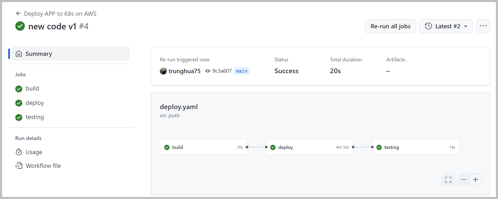
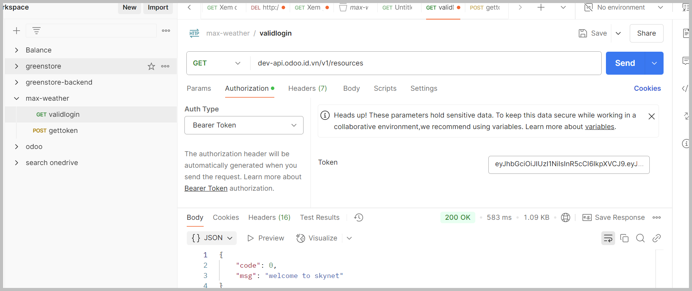
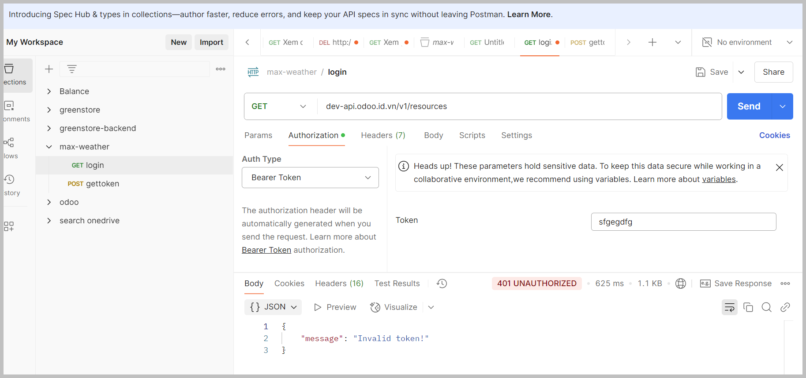
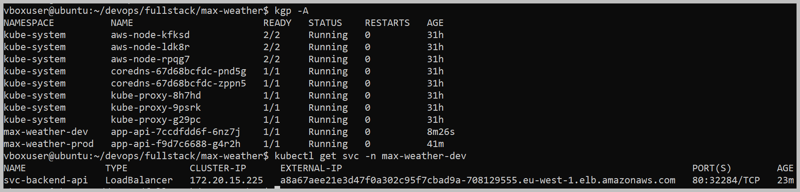
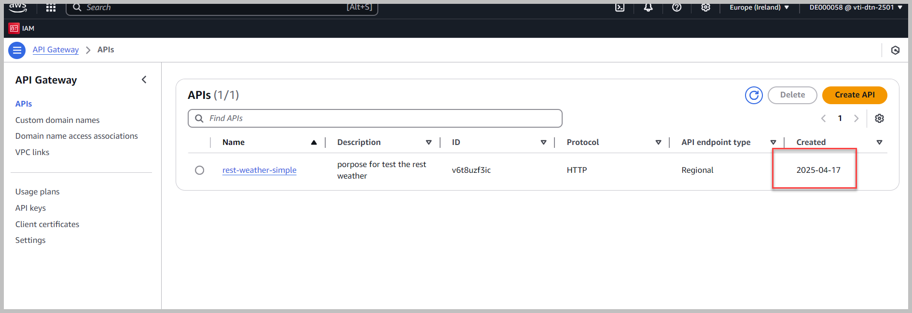

**PROJECT DIAGRAM**

**PROJECT STRUCTURE**

1. app.api → Contains the API implementation with a self-implemented OAuth2 system. The codebase is written in Python.
2. app.tf → Contains Terraform scripts for provisioning infrastructure.
3. app.eksconfig → Contains the configuration and setup for the EKS cluster.
4. logs → This folder is automatically created after running the application.
5. .github → Contains the CI/CD pipeline configuration.
6. report-resources → Contains the images for reporting

**GIT REPO**

The repository has two branches: dev and main.

**CICD PIPELINE**

the cicd pipeline

**POSTMAN TEST**

1. authentication!
   
2. query with valid token
   
3. invalid token
   

**EKS DEPLOYMENT**

all environment is deployment to eks

**SIMPLE API GATEWAY**

